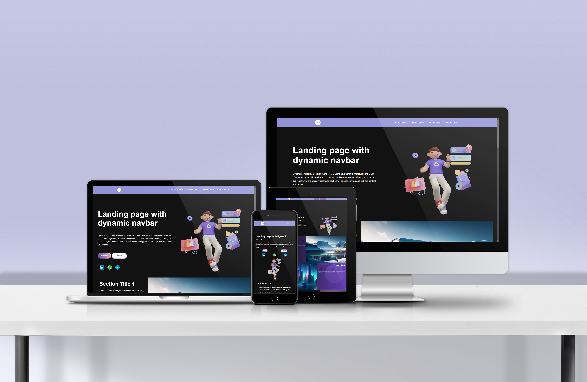

# Landing Page Project

## Table of Contents

- [Landing Page Project](#Landing-Page-Project)
- [Table of Contents](#Table-of-Contents)
- [Insulation](#Insulation)
- [Description](#Description)
- [Project stages](#Project-stages)
  - [The project Architecture](#The-project-Architecture)
    - HTML Structure
    - Styling and Responsiveness
  - [Landing Page Behavior](#Landing-Page-Behavior)
    - Dynamic Navigation Bar
    - Section Active State
    - Smooth Scrolling using JS
- [Author](#Author)
- [Technologies and Dependencies used](#Technologies-used-and-Dependencies-used)

## Insulation

You only need a bowser to open the HTML file.

## Description

Create an engaging multi-section landing page with dynamic navigation. Enhance user experience by highlighting the active section and implementing smooth scrolling for seamless navigation.

## Project stages

1. HTML Structure
   - Four sections have been added to the page.
2. Styling
   - Styling added successfully for active states.
   - CSS class active state when the element is in the viewport.
   - The active section in the Navbar is highlighted successfully .

## Landing Page Behavior

1. Dynamic Navigation Bar
2. Section Active State
3. Nav bar Active State
4. Smooth Scrolling using JS

## Technologies and Dependencies used

1. Javascript
2. Intersection-observer a library
3. Css
4. HTML
5. Markdown

## Creadits

Landing Page Project is the first project in the Professional Front-End Web Development Nanodegree Program provided by Udacity

## Author

Name: Hossam Ayman
